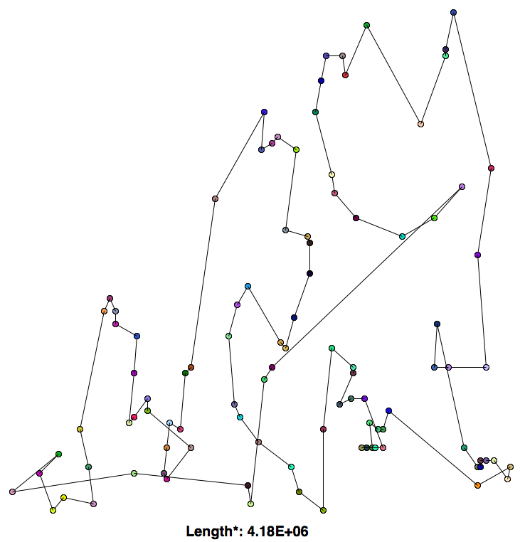

# Traveling Salesman Problem

Formally, the problem asks to find the minimum distance cycle in a set of nodes in 2D space. Informally, you have a salesman who wants to visit a number of cities and wants to find the shortest path to visit all the cities. This NP-hard problem has no efficient algorithm to find the optimal solution (for now...).

I had a competition with my friends to see who could find the shortest path in the 100 city dataset we were given in a given amount of time. I realized that all TSP algorithms spend a lot of time looping through objects, and Python has notoriously slow for-loops, so I figured that instead of coming up with a fancy algorithm, I could snake the competition by using Numba/Numpy/Cython/Inline C to speed up a simpler algorithm. Lets see how it goes.

# Algorithms

## Brute Force
Searches every permutation of cycles and returns the shortest one. Simple algorithm that guarantees the optimal solution, but has O(N!) efficiency, and is therefore not feasible to run on a 100 city dataset (at least on my puny computer), regardless of how fast your for loops were.

## Greedy
1. Starts at an arbitrary city
2. Go to the next closest unvisited city
3. Repeat (2) until all cities have been visited, save path length
4. Start again at (1) with a diferent initial city.
5. Repeat (1-4) until all possibilities have been exausted and return the shortest path

While this algorithm is relatively fast O(N^3), it does not come up with very good solutions.

*The length shown is not the sum of the distances from each city to the next, but rather the sum of the *square* of the distances form each city to the next. This applies for all algorithms shown.

## 2-opt swap
1. Start with a random route
2. Perform a swap between two edges
3. Keep new route if it is shorter
4. Repeat (2-3) for all possible swaps
5. Repeat (1-5) for M possible initial configurations

This algorithm is both faster, O(M*N^2) and produces better solutions. The intuition behind the algorithm is that swapping two edges at a time untangles routes that cross over itself.

![2-opt.png]
The 2-opt swap performed much better than greedy; the path it drew looks similar to something a human might draw.

## N-opt swap

Same as the 2-opt swap, but instead swapping N nodes at a time. This leads to more stochasticity, decreasing the chances of falling into a local minima while also allowing the algorithm to explore more of the search space, at the cost of a more coarse search. This algorithm approaches The Random AlgorithmTM as N approaches the number of cities.

![3-opt.png]

In this example I used a 3-opt swap. Interestingly, it performed much worse than both the 2-opt swap and the greedy algorithm. I'm not sure why this is the case.

# Optimizations

## Numpy

Although normally Python lists are more efficient than Numpy arrays when indexed, Numba should optimize Numpy array indexing.

## Numba

A "Numpy aware" JIT compiler.

## Inline C

I tried to use Weave for inline C code for the distance_squared function, since I spent a lot of time it in, but for some reason this ended up being slower than Numba.

## Cython

I ended up not getting to this, but it would likely have been similar to Numba-level performance.

# Outcome

I lost the competition :(. I learned that a good algorithm >> low-level optimizations. If I could go back I would try to create an algorithm that tried to find a convex route (or as close to possible), since that is what I noticed us humans subconciously try to do when coming up with solutions to TSP, which we are actually quite good at. On the bright side, because I spent so much time struggling to install Numba properly, I finally started to use a real package manager (conda; it's reallyyy nice would reccomend).

# Run Intructions

Dependencies
-	Python3
-	Numpy
-	TKinter

Edit the import statement in salesman.py to use the algorithm of your choice. For example, to use the algorithm in `brute.py`, the statement would be `from brute import algorithm`. Finally, run via

`python salesman.py`
